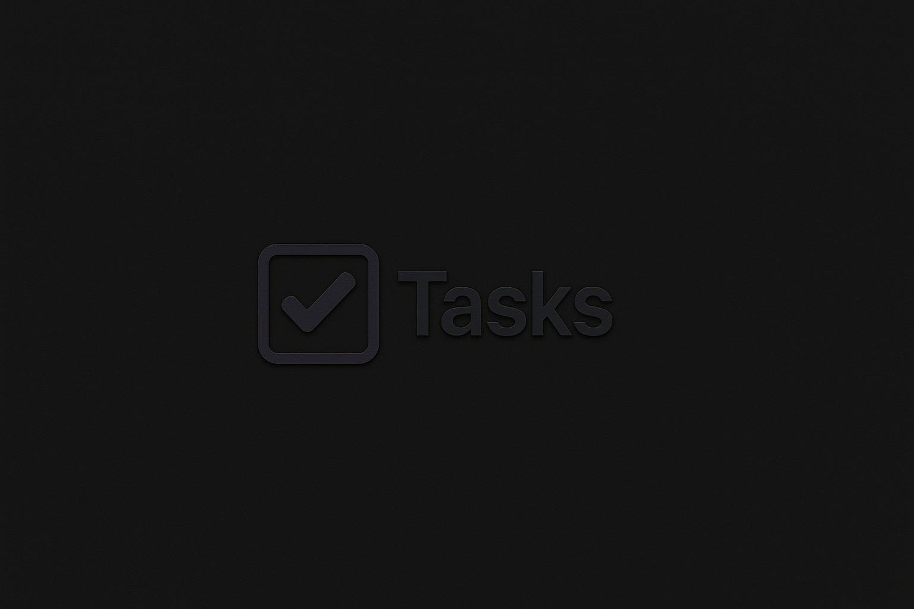

# 📝 Tasks — A Simple & Powerful Task Tracker

<div align="center">
  
</div>

Welcome to **Tasks**, a lightweight but powerful self-hostable task tracker built with Flask & Docker.  
Whether you're just trying to stay on top of your projects or you want to monitor a team's progress, **Tasks** has you covered.

---

## 🚀 Features

- 🔍 **Advanced Filtering** – Quickly filter tasks by user, date, or keyword.
- 📊 **Aggregate View** – View monthly totals of time spent per user.
- 👑 **Admin Panel** – Admins get access to:
  - 🧠 User statistics
  - 📜 Recent logs
  - 🛠 Project management
  - 👥 Admin account creation

---

## 📦 Getting Started

Follow these steps to run the app locally or on a remote machine using Docker:

1. **Copy this docker-compose.yml file**  
   ```yaml
   services:
      tasks:
         image: ghcr.io/viananike/tasks:latest
         ports:
            - "5000:5000"
         env_file:
            - .env
         environment:
            - SECRET_KEY=dev-key
            - POSTGRES_USER=user
            - POSTGRES_PASSWORD=changeme
            - POSTGRES_DB=postgres
         depends_on:
            - db

      db:
         image: ghcr.io/viananike/tasks-db:latest
         environment:
            - POSTGRES_USER=user
            - POSTGRES_PASSWORD=changeme
            - POSTGRES_DB=postgres
         volumes:
            - postgres_data:/var/lib/postgresql/data
         ports:
            - "5432:5432"

   volumes:
     postgres_data:


   ```
2. ⚠️ **Security Redommendations** ⚠️

   The environment variables defined in the `docker-compose.yml` file are **default values**, primarily for convenience. **You should override them using a `.env` file** for better security and flexibility. An example file is provided as `.env.example`.

   Docker Compose will **prioritize variables** from the `.env` file over anything specified in the `environment` section, so you don't need to delete the defaults — they’ll be safely overridden.

   To generate a secure secret key and append it to your `.env`, run:

   ```bash
   echo "SECRET_KEY=$(openssl rand -hex 32)" >> .env
   ```


3. **Run with docker:**
   ```bash
   docker compose up -d
   ```
4. **Visit http://ip-of-your-machine:5000 and set up your admin account!**

---

## 🛣 Roadmap

Here's what might be coming soon (or eventually!):

- [ ] 🗓️ Calendar view
- [ ] 🌓 Light & Dark mode toggle
- [ ] 📬 Email verification
- [ ] 🔔 Notification system
- [ ] 📎 File attachments
- [ ] 📱 Mobile-friendly tweaks

> Got an idea? [Open an issue](https://github.com/viananike/tasks/issues) or fork the project and go wild!

---

## 👨‍💻 About the Author

Hi! I'm just a hobbyist who loves:
- 🏡 Homelabbing  
- 🐳 Docker deployments  
- 👨‍💻 Building my own tools  

This project is maintained in my spare time. That means:
- 🐞 There **will** be bugs.  
- 🧪 Features may change or break.  
- 🛠️ Contributions and feedback are welcome!

---

## ⚠️ Disclaimer

Use at your own risk. Not intended for enterprise or mission-critical use... yet 😅

---

## 🧾 License

[MIT](LICENSE)

---

Thanks for checking out **Tasks**! ✨  
Made with ☕ and a love for tinkering.
